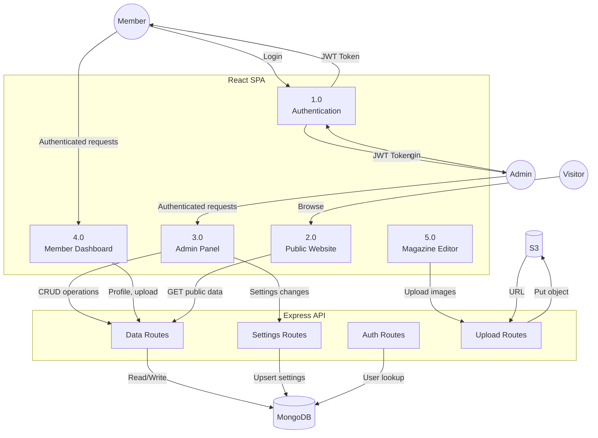
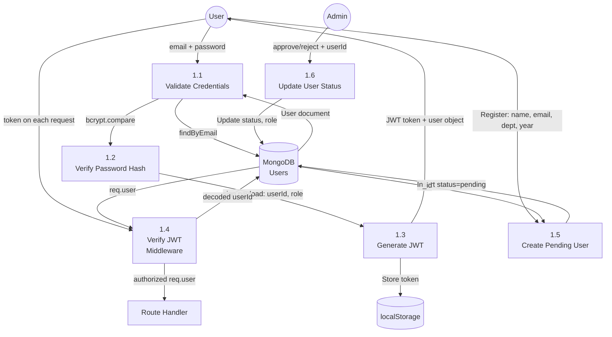
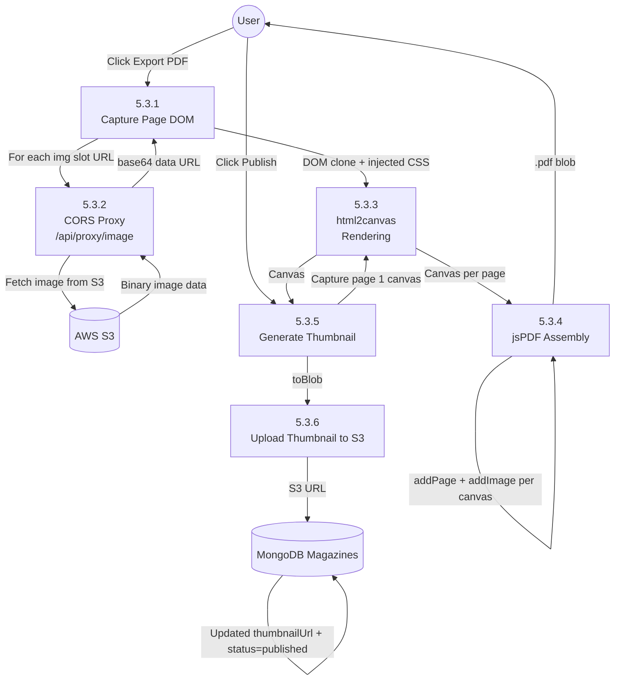

# Data Flow Diagrams (DFD)
## IEM Photography Club Web Platform

**Version:** 1.0  
**Date:** June 2026  
**Notation:** Yourdon-DeMarco (Mermaid flowchart syntax)

---

## Level 0 — Context Diagram

The entire system as a single process exchanging data with external entities.

```mermaid
flowchart LR
    ANON((Anonymous\nVisitor))
    MEMBER((Club\nMember))
    ADMIN((Admin /\nCore))
    S3[(AWS S3)]
    SMTP((Email\nServer)]

    ANON -->|Browse website, view events/gallery/magazines| SYS[IEM Photography\nClub Platform]
    MEMBER -->|Login, upload photos, edit profile, build magazines| SYS
    ADMIN -->|Manage users, events, settings, publish content| SYS
    SYS -->|Page data, gallery photos, magazine PDFs| ANON
    SYS -->|Dashboard data, notifications| MEMBER
    SYS -->|Admin reports, approval actions| ADMIN
    SYS -->|Upload/Download file requests| S3
    S3 -->|Presigned URLs, file stream| SYS
    SYS -->|Approval notifications, rejection emails| SMTP
    SMTP -->|Delivery status| SYS
```

---

## Level 1 — System Decomposition

Major subsystems and data flows between them.



---

## Level 2 — Authentication Subsystem (Process 1.0)



---

## Level 2 — Event Management Subsystem (Process 3.2)

```mermaid
flowchart TD
    ADMIN((Admin/Core))
    COORD((Coordinator))
    VISITOR((Visitor))
    DB[(MongoDB Events)]
    S3[(AWS S3)]

    ADMIN -->|title, date, desc, coverPhoto| P3_1[3.2.1\nCreate Event]
    P3_1 -->|Insert Event doc| DB
    P3_1 -->|Upload cover photo| S3

    ADMIN -->|eventId, updates| P3_2[3.2.2\nEdit Event]
    P3_2 -->|findByIdAndUpdate| DB

    ADMIN -->|eventId + userId + perms| P3_3[3.2.3\nAssign Coordinator]
    P3_3 -->|Push to members[]| DB

    COORD -->|eventId + photos| P3_4[3.2.4\nUpload Gallery Photos]
    P3_4 -->|Check canUploadGallery permission| DB
    P3_4 -->|Upload files| S3
    S3 -->|URLs| P3_4
    P3_4 -->|Push to gallery[]| DB

    DB -->|Event status auto-computed from dates| P3_5[3.2.5\nAuto Status Compute]
    P3_5 -->|upcoming / ongoing / past| DB

    VISITOR -->|GET /events| P3_6[3.2.6\nServe Public Events]
    DB -->|Published events + galleries| P3_6
    P3_6 -->|Event list + gallery URLs| VISITOR
```

---

## Level 2 — Magazine PDF Export (Process 5.3)



---

## Level 2 — Settings Propagation (Process 3.6 / Hero Mode)

```mermaid
flowchart TD
    ADMIN((Admin))
    ALLUSERS((All Users\nAny Device))
    DB[(MongoDB AppSettings)]
    LS[(localStorage\nper-browser)]

    ADMIN -->|Toggle hero mode| P3_6_1[3.6.1\nWrite to localStorage\n + PATCH /api/settings/desktopHeroMode]
    P3_6_1 -->|optimistic update| LS
    P3_6_1 -->|upsert { key, value }| DB

    ALLUSERS -->|Every 5 seconds: GET /api/settings/content| P3_6_2[3.6.2\nFetch Hero Setting\nvia useData poll]
    DB -->|{ desktopHeroMode: 'video'|'classic' }| P3_6_2
    P3_6_2 -->|heroSettingData changed| P3_6_3[3.6.3\nuseEffect: apply new mode]
    P3_6_3 -->|setDesktopHeroMode| ALLUSERS
    P3_6_3 -->|localStorage cache update| LS
```

---

## Data Dictionary

| Data Flow | Contents | Format |
|-----------|----------|--------|
| JWT Token | `{ userId, role, iat, exp }` | Signed JWT string |
| User Document | name, email, passwordHash, role, status, dept, years, photo, bio | BSON/JSON |
| Event Document | title, date, endDate, cover, gallery[], members[], status | BSON/JSON |
| Magazine Document | title, pages[], status, templateId, thumbnailUrl | BSON/JSON |
| Page Slot | imageUrl / text value, slotId, cropData | JSON embedded |
| AppSettings | `{ key, value, label, updatedBy }` | Key-value BSON |
| S3 Upload | multipart/form-data binary | HTTP multipart |
| S3 URL | `https://<bucket>.s3.<region>.amazonaws.com/<key>` | HTTPS URL string |
| Proxy Response | `data:<mime>;base64,<encoded>` | Data URL |
| PDF Blob | Binary PDF data | application/pdf |
